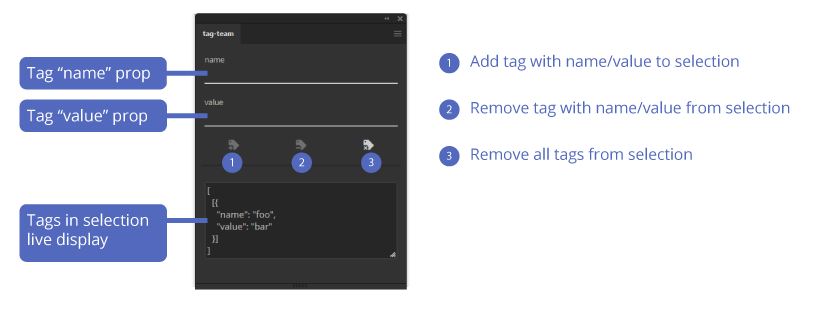

# tag-team

Utility to read, write, modify and delete hidden Tag array items within PageItems.

## Installation and use

- [Download the ZXP by clicking here](https://github.com/Inventsable/tag-team/raw/master/archive/tag-team_1.0.0.zxp)
- Use a valid ZXP installer (like [ZXPInstaller](https://zxpinstaller.com/) or [Anastasiy's Extension Manager](https://install.anastasiy.com/)) and open the ZXP
- Relaunch Illustrator and find in Windows > Extensions > Pathfinder Plus

---

